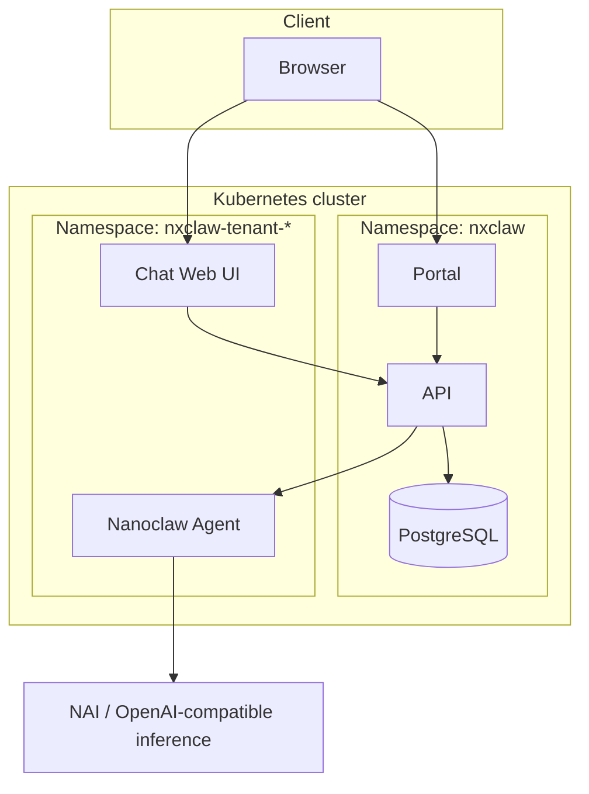

# NXClaw — Architecture

This document is the single source of truth for system architecture, deployment topology, and component boundaries.

---

## 1. Purpose

NXClaw is an autonomous agent fleet platform based on [Nanoclaw](https://github.com/qwibitai/nanoclaw). It provides a centralized portal for managing agents in a multi-tenant environment, with Kubernetes isolation, configurable inference (e.g. Nutanix Enterprise AI), and a Web UI for chat.

---

## 2. High-level architecture



- **Portal:** Admin and tenant UI; login; manage agent config and inference endpoints. Served as a static SPA (Vite + React) behind nginx.
- **Chat Web UI:** Dedicated app for chatting with the agent; calls the API to send messages and receive responses.
- **API:** Node.js (Express) backend. Auth (JWT), agent config and inference endpoint CRUD, chat session and message persistence, proxy to Nanoclaw. Connects to PostgreSQL.
- **PostgreSQL:** Single database (PVC-backed). Tables: tenants, users, inference_endpoints, agent_config, chat_sessions, messages. pgVector can be enabled for embeddings later.
- **Nanoclaw:** Runs as a separate deployment (V1: one per tenant namespace). Receives requests from the API; calls external NAI (OpenAI-compatible) for inference.

---

## 3. Repository layout

```
nxclaw/
├── apps/
│   ├── api/                 # Backend API (Node.js, Express, TypeScript)
│   │   ├── src/
│   │   │   ├── index.ts
│   │   │   ├── db/
│   │   │   ├── routes/
│   │   │   └── middleware/
│   │   ├── Dockerfile
│   │   └── package.json
│   ├── portal/              # Portal SPA (Vite, React)
│   │   ├── src/
│   │   ├── nginx.conf       # Production serve + /api proxy
│   │   ├── Dockerfile
│   │   └── package.json
│   └── chat-ui/             # Chat Web UI (Vite, React) — same stack as portal
├── packages/
│   ├── ui/                  # Shared React components and design tokens
│   └── shared/              # Shared TypeScript types
├── infra/                   # Kubernetes manifests
│   ├── base/                # Kustomize base (namespace, postgres, api, portal)
│   └── overlays/
│       └── default/        # Image tags and env
├── docs/
└── package.json             # Workspace root
```

---

## 4. Component boundaries

| Component    | Responsibility |
|-------------|----------------|
| **Portal**  | Login (local user in DB), dashboard, agent config and inference endpoint management. Calls API only. |
| **Chat UI** | Chat interface; POST message, display response. Calls API only. |
| **API**     | Auth (login → JWT); CRUD for agent_config and inference_endpoints; chat sessions and messages; proxy requests to Nanoclaw; persist to Postgres. |
| **Postgres**| Persistent store for users, tenants, agent_config, inference_endpoints, chat_sessions, messages. |
| **Nanoclaw**| Agent runtime; receives chat from API; calls NAI (or other OpenAI-compatible) for inference. |

---

## 5. API surface (Backend)

All under base path `/api`. Request/response JSON; auth via `Authorization: Bearer <JWT>` except for login.

| Method | Path | Auth | Purpose |
|--------|------|------|---------|
| GET | /health | No | Liveness |
| POST | /api/auth/login | No | Login (username, password) → JWT |
| GET | /api/agent-config | Yes | List agent configs |
| POST | /api/agent-config | Yes | Create agent config |
| GET | /api/agent-config/:id | Yes | Get one |
| PATCH | /api/agent-config/:id | Yes | Update |
| GET | /api/inference | Yes | List inference endpoints |
| POST | /api/inference | Yes | Create endpoint |
| GET | /api/chat/sessions | Yes | List chat sessions |
| POST | /api/chat/sessions | Yes | Create session |
| GET | /api/chat/sessions/:id/messages | Yes | List messages |
| POST | /api/chat/sessions/:id/messages | Yes | Send message (proxied to Nanoclaw) |

---

## 6. Data model (V1)

- **tenants** — id, name (V1: single row).
- **users** — id, tenant_id, username, password_hash, role (admin/user).
- **inference_endpoints** — id, tenant_id, label, base_url, api_key_ref.
- **agent_config** — id, tenant_id, name, inference_endpoint_id, config_json.
- **chat_sessions** — id, tenant_id, user_id, title.
- **messages** — id, session_id, role (user|assistant), content.

API seeds one tenant and one admin user on first startup if none exist.

---

## 7. Deployment topology (Kubernetes)

- **Namespace:** `nxclaw` for Portal, API, Postgres. (Tenant namespaces for Chat UI + Nanoclaw can be added later.)
- **Portal:** Deployment (nginx serving built SPA, proxy `/api` to API service); Service type LoadBalancer (port 80).
- **API:** Deployment (Node.js); Service type ClusterIP (port 3000). Env: DATABASE_URL, JWT_SECRET.
- **Postgres:** Deployment + PVC + ClusterIP Service. Secret for password.
- **Images:** API and Portal are built from `apps/api` and `apps/portal` Dockerfiles. Image names and registry are set via Kustomize (see Deployment doc).

---

## 8. Security

- No secrets in repo; DB password and JWT secret from Kubernetes Secrets.
- Passwords hashed with bcrypt; JWT for API auth.
- Input validation (Zod) and path sanitization at API boundaries.
- NAI API key stored by reference (e.g. secret name); not in DB.

---

## 9. References

- [Specification](NXClaw-SPECIFICATION.md)
- [Application overview](APPLICATION.md)
- [Deployment](DEPLOYMENT.md)
