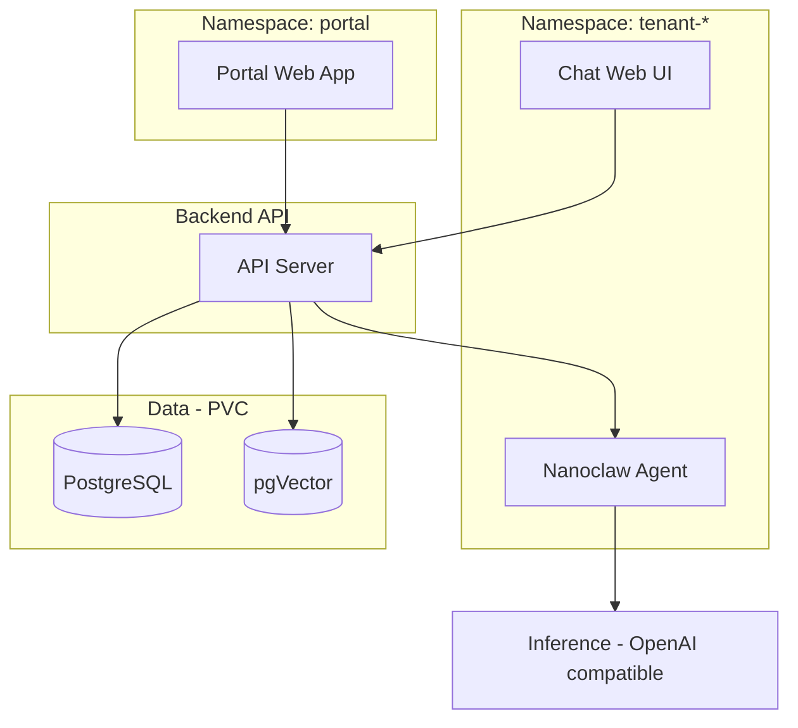

# NXClaw — SPARC Architecture (Phase 2)

**Artifact:** Architecture — system structure, components, interfaces  
**Project:** NXClaw (002-NXClaw)  
**Phase:** 2 — Architecture  
**Status:** Approved — ready for Refinement (TDD)  
**Spec reference:** [NXClaw-SPECIFICATION.md](NXClaw-SPECIFICATION.md)

---

## 1. High-level architecture

- **Portal:** One web app (admin + tenant areas), local user auth, fast/small/responsive. Runs in its own Kubernetes namespace.
- **Chat Web UI:** Separate web app for chatting with the agent; request/response (no streaming in V1).
- **Backend API:** Orchestration, config, inference routing. Single REST API consumed by Portal and Chat Web UI.
- **Agent runtime:** Nanoclaw deployed as-is (official image/Helm); one Deployment + PVC per tenant namespace.
- **Inference:** External OpenAI-compatible endpoint (NAI); agent is pointed at it via config.
- **Data:** PostgreSQL + pgVector, PVC-backed, for agent config, chat history, users, inference endpoint config.

---

## 2. Component boundaries

| Component      | Responsibility |
|----------------|----------------|
| **Portal**    | Admin + tenant areas; local user auth; manage Nanoclaw instance (deploy/config/status). |
| **Chat Web UI** | User-facing chat; send message to agent, show response; talks to Backend API only. |
| **Backend API** | Auth, agent config CRUD, chat session persistence, proxy/route requests to Nanoclaw; store/read from Postgres + pgVector. |
| **Nanoclaw**  | Run agent as-is; receive requests from Backend API; call external inference (NAI). |
| **PostgreSQL** | Relational data: users, tenants (V1: single), agent config, inference endpoint config. |
| **pgVector**  | Vector storage (e.g. embeddings for chat/memory). |

---

## 3. Kubernetes layout (V1)

| Namespace   | Contents |
|------------|----------|
| `nxclaw-portal` (or similar) | Portal web app deployment. |
| `nxclaw-tenant-default` (or one tenant NS) | Chat Web UI + Nanoclaw agent (one Deployment + PVC). |
| Shared/data NS | Backend API; PostgreSQL + pgVector (PVC-backed). |

- Separate namespace per tenant (V1: one tenant).
- Portal in its own namespace.
- Agent: one Deployment + one PVC per tenant.

---

## 4. Data model (V1)

**Persistent (PVC-backed):**

- **Users:** single admin (local auth); single tenant for V1.
- **Agent config:** Nanoclaw instance config (inference endpoint URL, API key ref, etc.).
- **Chat history:** per user/session; store in DB (and optionally vectors in pgVector for future retrieval).
- **Inference endpoint config:** URL, label, OpenAI-compatible; NAI is primary.

V1 = single admin, single tenant; tenant model in schema but one row.

---

## 5. APIs and integration

- **Portal and Chat Web UI** both talk to the **same Backend API** (REST).
- **Request/response only** for V1 (no WebSockets/SSE).
- Backend API:
  - Authenticates users (local auth).
  - Serves agent config, inference endpoint config.
  - Accepts chat messages, forwards to Nanoclaw agent; agent calls external inference (NAI); response returned to client.

---

## 6. Nanoclaw integration

- Deploy Nanoclaw **as-is** (official image/Helm chart).
- Portal only **configures and talks to** it (via Backend API → Nanoclaw).
- No fork or custom image required for V1.

---

## 7. Front-end stack

- **Portal:** One web app, admin + tenant areas; **fast, small, responsive** (e.g. Svelte, Vue, or React with small bundle).
- **Chat Web UI:** Separate app; same or similar stack for consistency; request/response only.

(Exact framework choice left to implementation; DDD and project rules from CLAUDE.md apply.)

---

## 8. Security and constraints

- No secrets in repo; use K8s secrets or external secret store for API keys (e.g. NAI).
- Local user auth (credentials in DB or integrated with existing auth).
- Input validation and path sanitization at API and app boundaries (per spec NF3).

---

## 9. V1 deployment summary

| Item | Decision |
|------|----------|
| Portal | One app, admin + tenant areas; own namespace. |
| Chat | Separate Web UI; same backend API. |
| Backend | Single REST API; orchestration, config, chat, agent proxy. |
| Agent | Nanoclaw as-is; one Deployment + PVC per tenant NS. |
| Inference | External NAI (OpenAI-compatible); agent configured to use it. |
| Data | Postgres + pgVector, PVC-backed. |
| Tenancy | Single admin, single tenant; separate namespace per tenant. |
| Traffic | Request/response only. |

---

## 10. References

- [NXClaw-SPECIFICATION.md](NXClaw-SPECIFICATION.md)
- [CLAUDE.md](../CLAUDE.md)

---

*Next: Phase 3 — Refinement (TDD): implement to this architecture.*
